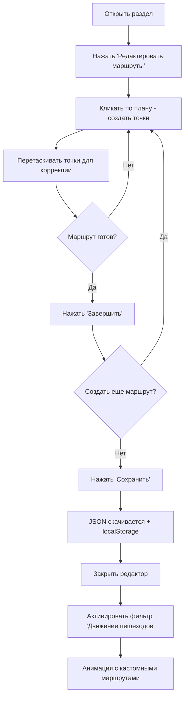

# 🎨 Редактор маршрутов пешеходов - Документация

## ✅ Реализовано

Создан полнофункциональный встроенный редактор для визуального построения и редактирования маршрутов движения пешеходов в разделах **"Планировочные решения"** и **"Благоустройство"**.

---

## 📋 Компоненты

### 1. **RouteEditor.jsx** - Основной редактор
**Расположение**: `src/components/RouteEditor.jsx`

**Функционал**:
- ✏️ Создание маршрутов кликами по плану
- 🎯 Перетаскивание точек для коррекции
- 💾 Сохранение маршрутов в JSON и localStorage
- 🗑️ Удаление отдельных маршрутов и точек
- 📥 Импорт маршрутов из JSON файлов
- 📊 Визуальное отображение всех маршрутов

**Props**:
- `planId` (string) - ID плана для сохранения/загрузки маршрутов
- `onClose` (function) - Callback для закрытия редактора

### 2. **PedestrianLayer.jsx** - Анимация пешеходов
**Расположение**: `src/components/PedestrianLayer.jsx`

**Обновления**:
- 🔄 Автоматическая загрузка кастомных маршрутов
- 📂 Поддержка localStorage и JSON файлов
- 🎨 Динамическая генерация SVG path из точек
- ⚙️ Fallback на дефолтные маршруты

**Props**:
- `planId` (string, default: 'default') - ID плана для загрузки маршрутов

---

## 🚀 Использование

### В разделе "Планировочные решения"

1. Откройте раздел "Планировочные решения"
2. Выберите нужный этаж
3. Нажмите кнопку **"Редактировать маршруты"** в правой панели
4. Откроется редактор:
   - **Кликайте** по плану для создания точек маршрута
   - **Перетаскивайте** точки для коррекции
   - **Нажмите "Завершить"** когда маршрут готов (минимум 2 точки)
   - **Нажмите "Сохранить"** для экспорта JSON
5. Маршруты автоматически сохранятся в localStorage и скачаются как JSON
6. Закройте редактор кнопкой **"Закрыть"**
7. Активируйте фильтр **"Движение пешеходов"** для просмотра анимации

### В разделе "Благоустройство"

Аналогично разделу "Планировочные решения", но:
- `planId` = `"genplan"`
- Маршруты для генплана

---

## 📁 Структура данных

### Формат JSON маршрута:
```json
[
  {
    "id": "route-1682345678901",
    "points": [
      { "x": 120, "y": 170 },
      { "x": 250, "y": 170 },
      { "x": 420, "y": 200 },
      { "x": 700, "y": 200 }
    ]
  },
  {
    "id": "route-1682345678902",
    "points": [
      { "x": 200, "y": 400 },
      { "x": 400, "y": 350 },
      { "x": 950, "y": 400 }
    ]
  }
]
```

### Именование файлов:
- **Генплан**: `routes/genplan.json`
- **Планы этажей**: `routes/[floorId].json`
  - Примеры:
    - `routes/underground-ground.json`
    - `routes/general-floor-1.json`
    - `routes/section1-floor-2.json`
    - `routes/section1-floor-3-10.json`

---

## 🔄 Логика загрузки маршрутов

PedestrianLayer загружает маршруты в следующем порядке:

1. **localStorage** (приоритет) - ключ: `routes-${planId}`
2. **JSON файл** - путь: `/routes/${planId}.json`
3. **Дефолтные маршруты** - если ничего не найдено

```javascript
// Пример загрузки
const localData = localStorage.getItem(`routes-${planId}`);
if (localData) {
  setCustomRoutes(JSON.parse(localData));
} else {
  const response = await fetch(`/routes/${planId}.json`);
  if (response.ok) {
    setCustomRoutes(await response.json());
  }
}
```

---

## 🎨 Визуальные элементы

### В редакторе:

| Элемент | Цвет | Описание |
|---------|------|----------|
| **Сохраненные маршруты** | Голубой (#00e5ff) | Готовые маршруты |
| **Текущий маршрут** | Желтый (#ffc107) | Маршрут в процессе создания |
| **Точки маршрута** | Белый контур | Перетаскиваемые точки |
| **Пунктирная линия** | Желтый (8-4) | Текущий редактируемый путь |
| **Сплошная линия** | Голубой | Сохраненный путь |

### В анимации:

| Элемент | Стиль | Эффект |
|---------|-------|--------|
| **Линии маршрутов** | Голубые, пунктир | Анимация движения |
| **Пешеходы** | Желтые точки | Пульсация + движение |
| **Свечение** | Drop-shadow | Объем и акцент |

---

## 🛠️ Технические детали

### Координатная система:
- **ViewBox SVG**: `0 0 1200 675`
- Координаты точек относительно этого ViewBox
- Автоматическое масштабирование под размер контейнера

### Конвертация точек в SVG path:
```javascript
const pointsToPath = (points) => {
  let path = `M ${points[0].x} ${points[0].y}`;
  for (let i = 1; i < points.length; i++) {
    path += ` L ${points[i].x} ${points[i].y}`;
  }
  return path;
};
```

### Управление состоянием:
- **currentRoute**: Текущий редактируемый маршрут (массив точек)
- **savedRoutes**: Все сохраненные маршруты
- **isDragging**: Флаг перетаскивания
- **draggedPointIndex**: Индекс перетаскиваемой точки

---

## 📝 Интеграция

### PlanningSolutions.jsx:
```jsx
const [isEditorOpen, setIsEditorOpen] = useState(false);

// Кнопка открытия редактора
<motion.button onClick={() => setIsEditorOpen(true)}>
  <Edit3 size={16} />
  Редактировать маршруты
</motion.button>

// Условный рендер
{activeLayers.includes('pedestrian') && !isEditorOpen && (
  <PedestrianLayer planId={selectedFloor} />
)}

{isEditorOpen && (
  <RouteEditor
    planId={selectedFloor}
    onClose={() => setIsEditorOpen(false)}
  />
)}
```

### Landscaping.jsx:
```jsx
const [isEditorOpen, setIsEditorOpen] = useState(false);

// Аналогично PlanningSolutions, но planId="genplan"
<PedestrianLayer planId="genplan" />
<RouteEditor planId="genplan" onClose={...} />
```

---

## 💡 Подсказки для пользователя

### В редакторе отображаются:
1. **Текущий маршрут** - счетчик точек, кнопки "Отменить" и "Завершить"
2. **Список маршрутов** - все сохраненные маршруты с кнопками удаления
3. **Панель действий** - Сохранить, Очистить, Закрыть
4. **Подсказка внизу** - "Кликайте по плану, чтобы создать точки..."

---

## 🎯 Workflow (Рабочий процесс)



---

## 📦 Файлы проекта

### Измененные файлы:
1. ✅ `src/components/RouteEditor.jsx` (создан)
2. ✅ `src/components/PedestrianLayer.jsx` (обновлен)
3. ✅ `src/pages/PlanningSolutions.jsx` (обновлен)
4. ✅ `src/pages/Landscaping.jsx` (обновлен)

### Созданные директории и файлы:
5. ✅ `PUBLIC/routes/` (директория)
6. ✅ `PUBLIC/routes/README.md` (инструкция)
7. ✅ `PUBLIC/routes/genplan.json` (пример маршрутов)
8. ✅ `ROUTE_EDITOR_DOCUMENTATION.md` (эта документация)

---

## 🎉 Результат

Теперь администратор сайта может:

✅ **Визуально создавать** маршруты движения пешеходов  
✅ **Редактировать** существующие маршруты перетаскиванием  
✅ **Сохранять** маршруты в JSON и localStorage  
✅ **Использовать** кастомные маршруты в анимации  
✅ **Импортировать** маршруты из файлов  
✅ **Управлять** маршрутами для каждого плана отдельно  

Редактор полностью интегрирован в оба раздела (**"Планировочные решения"** и **"Благоустройство"**) и готов к использованию! 🚀

